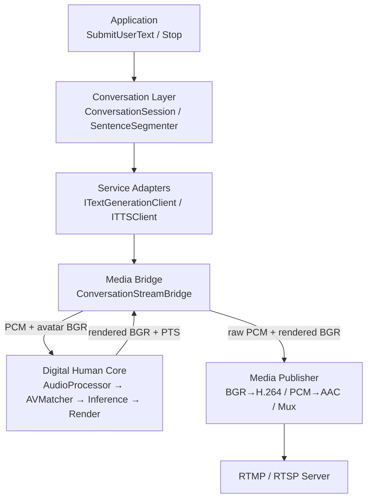
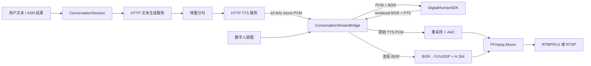
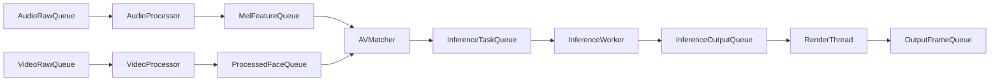

# Digital Human SDK 架构总览

本文描述当前代码实现。系统以既有 Wav2Lip PCM/BGR 流水线为核心，外围增加了通用文本生成、TTS、AAC/H.264 编码以及 RTMP/RTSP 发布能力。文本模型和 TTS 仍是外部网络服务，SDK 不绑定 llama.cpp 或特定推理框架。

## 1. 系统边界

SDK 当前负责：

- 调用通用 HTTP 文本生成服务，或通过 OpenAI Chat Completions 适配器调用 llama.cpp，处理 JSON/SSE 响应；
- 将增量回复分句后调用 TTS，接收 16 kHz 单声道 float PCM；
- 用 PCM 和数字人底图驱动 Wav2Lip Pipeline，输出带 PTS 的 BGR 帧；
- 将原始 TTS PCM 分流到 AAC 编码器，将渲染 BGR 转换为 YUV420P 后编码为 H.264；
- 复用 FFmpeg muxer 向 RTMP 或 RTSP 地址发布音视频流。

SDK 当前不负责：

- 文本大模型或 TTS 模型的加载、推理和进程管理；
- ASR；上游可将识别结果作为用户文本提交；
- RTMP/RTSP 服务端；发布目标必须由业务方提供；
- 本机扬声器播放 TTS 回复。

## 2. 分层架构

公共接口按职责分布：

- `include/dialog/`：会话控制、通用/llama.cpp 文本生成适配和分句；
- `include/tts/`：TTS 与 PCM 数据契约；
- `include/network/`：不向公共 ABI 泄漏 libcurl 类型的 HTTP Transport；
- `include/media/`：编码、封装、推流和会话媒体桥接；
- `include/digital_human_sdk.h`：数字人口型 SDK。

## 3. 实时会话与推流闭环

`ConversationStreamBridge` 是会话层的 `IDigitalHumanSink` 实现。它把每个 TTS PCM Chunk 先提交给数字人 SDK 驱动口型，同时提交给 `StreamPublisher` 作为最终节目音轨；独立输出线程持续读取 SDK 渲染帧并送入 H.264 编码器。因此推流音频是可听的 TTS 原声，而视频是口型融合后的最终 BGR 画面。

## 4. 媒体发布层

`StreamPublisher` 是线程安全的有界队列发布器：

| 输入 | 处理 | 输出 |
|---|---|---|
| `CV_8UC3` BGR + 毫秒 PTS | swscale 转 YUV420P，H.264 编码 | H.264 packet |
| interleaved float PCM + 毫秒 PTS | swresample 转采样/格式，Audio FIFO，AAC 编码 | AAC packet |
| H.264 + AAC packet | FFmpeg interleaved mux | RTMP/FLV、RTSP 或测试文件 |

关键约束：

- 宽和高必须为正偶数，输入 BGR 尺寸必须与配置一致；
- 默认音频输入为 16 kHz 单声道，编码输出为 48 kHz 单声道 AAC-LC；
- 未指定 H.264 编码器时依次尝试 NVENC、QSV、AMF、libx264 和 FFmpeg 可用的 `h264` 编码器；
- 视频队列满时丢弃最旧帧，避免实时链路延迟无限增长；音频队列满时反压生产者，避免语音缺失；
- 关闭时可选择排空队列，并 flush 编码器、写 trailer；
- RTMP 使用 FLV muxer，RTSP 使用 FFmpeg RTSP muxer和可配置 TCP 传输。

发布器通过 `StreamPublisherMetrics` 暴露输入帧数、编码帧数、丢帧数、音频样本数和已写 packet 数，便于运行时监控。

## 5. 会话线程模型

`ConversationSession` 使用四条工作线程：

| 线程 | 输入 | 输出 | 目的 |
|---|---|---|---|
| Generation | 用户文本 | TTS 分句任务 | 增量调用文本服务并分句 |
| TTS | 分句任务 | PCM Chunk | 串行合成并保持语句顺序 |
| Audio Feeder | PCM Chunk | `PushAudio` | 独立处理音频反压 |
| Video Feeder | 音频水位 | `PushVideo` | 保持 Mel 预读后提交视频帧 |

`ConversationStreamBridge` 另有一条 SDK 输出线程；`StreamPublisher` 再使用一条编码/封装线程。这样网络 I/O 和编码不会进入核心推理线程。

## 6. 时间轴和同步规则

- TTS 音频是主时间轴，PTS 根据累计提交的输入样本数计算；
- 会话当前接受与核心 SDK 一致的 16 kHz 单声道 float PCM；
- 视频 PTS 根据帧序号和目标帧率计算，避免逐帧整数累加漂移；
- 同一份音频 PTS 同时用于口型驱动和 AAC 输入；最终 BGR 保留 SDK 输出 PTS；
- muxer 根据各自 stream time base 交错写入 H.264 和 AAC packet；
- 每轮回复末尾默认补静音以覆盖最后一个 Mel 窗；仅 Session 停止时发送 EOS。

## 7. 核心口型 Pipeline

AVMatcher 由视频帧驱动，每帧装配一个默认 `80 × 16` Mel 窗。静态数字人底图会命中 VideoProcessor 人脸缓存，避免逐帧重复检测和对齐。Pipeline 和 `DigitalHumanSDK` 是一次性运行对象；`Stop()` 后如需重新运行，应创建新对象。

## 8. 服务和部署边界

文本/TTS 请求格式见[会话服务接口协议](../guides/dialog_service_protocol.md)，llama.cpp 使用见[llama.cpp 接入指南](../guides/llama_cpp_integration.md)，编码与推流使用见[音视频编码与推流](../guides/stream_publishing.md)。

服务适配遵循：

- 模型无关：请求不包含 llama.cpp 等推理框架专有逻辑；
- ABI 隔离：公共头文件不暴露 libcurl 和 FFmpeg 上下文；
- 可取消：停止会话时 HTTP Transport 可终止请求；
- 发布端与服务端分离：SDK 只作为 RTMP/RTSP publisher，不内置流媒体服务器。

## 9. 测试分层

| 测试 | 覆盖范围 | 外部依赖 |
|---|---|---|
| `dialog_module_test` | 分句、串行 TTS、音视频供料、PTS、EOS | 无 |
| `http_service_client_test` | JSON/SSE 文本服务和裸 PCM TTS | 本地 mock 服务 |
| `conversation_sdk_integration_test` | 文本→TTS→真实 SDK→BGR | Wav2Lip/人脸模型 |
| `stream_publisher_test` | BGR/PCM→H.264/AAC→本地 FLV，解封装检查 | FFmpeg 编码器 |
| `conversation_stream_integration_test` | 文本→TTS→真实 SDK→H.264/AAC FLV | 模型和 FFmpeg 编码器 |
| `stream_network_publish_test` | RTMP/RTSP 网络发布握手和 packet 写入 | 外部 RTMP/RTSP 接收端 |
| `full_conversation_chain_test` | 真实 llama.cpp→HTTP TTS→Wav2Lip→H.264/AAC→文件或网络流 | llama.cpp、TTS 服务、模型和 FFmpeg |

本地 mock 服务位于 `tools/mock_dialog_service.py`。

## 10. 后续扩展

- ASR 输入和用户打断时的完整 flush/重启语义；
- 真正流式的 TTS 响应，进一步降低首音频延迟；
- 音视频重连、指数退避以及断线期间的队列策略；
- 独立的媒体时钟与更完整的 A/V 漂移监控；
- 生产环境硬件编码器能力探测与设备选择。

## 11. 相关文档

- [音视频编码与推流](../guides/stream_publishing.md)
- [llama.cpp 接入指南](../guides/llama_cpp_integration.md)
- [全链路闭环验收](../guides/end_to_end_validation.md)
- [会话服务接口协议](../guides/dialog_service_protocol.md)
- [多线程 Pipeline](multi_thread_pipeline.md)
- [音频处理线程](audio_processor_thread.md)
- [推理线程](inference_worker.md)
- [渲染线程](render_thread.md)
- [性能优化报告](../perf/pipeline_optimization_report.md)
- [Windows Vulkan 验证](../guides/windows_vulkan_gpu_validation.md)
