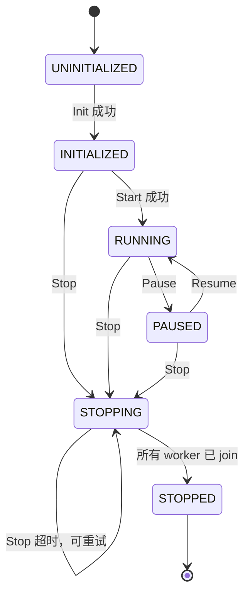

# 第一阶段稳定性改造：生命周期、线程回收与配置一致性

> 状态：已实施并完成基础回归验证  
> 日期：2026-08-11  
> 范围：`ThreadBase`、`Pipeline`、`DigitalHumanSDK` 及相关配置映射
> 后续状态：第二阶段已完成，普通 mutex、WorkerRegistry、AV 阈值、可观测指标与 CTest 以[第二阶段文档](phase2_lifecycle_observability_refactor.md)为准。

## 1. 改造背景

当前 SDK 采用多线程 Pipeline 串联音频处理、视频处理、音视频匹配、模型推理和渲染输出。原实现能够完成主流程，但生命周期边界存在以下风险：

1. `ThreadBase::Wait(timeout)` 通过短周期轮询判断退出，浪费唤醒并且无法可靠协调多个并发等待者。
2. 有限超时后如果释放或分离线程，线程仍可能访问已析构的 worker、队列或模型对象，形成悬空访问。
3. `Pipeline::Stop()` 对每个 worker 分别使用完整超时，整体停止时间可能膨胀为“worker 数量 × timeout”。
4. Stop 超时后缺少明确状态，调用方无法区分“已停止”和“仍在回收中”。
5. SDK 与 Pipeline 的配置字段映射不完整，部分合法性约束只在底层隐式假设，错误可能延迟到运行期。
6. 生命周期方法、模型管理方法和数据入口之间缺少统一的并发约束，存在 Start/Stop/Push/模型加载交错执行的风险。

第一阶段不改变媒体算法和模型推理结果，优先建立可预测、可验证的生命周期基础。

## 2. 第一阶段目标

### 2.1 核心目标

- 建立 SDK 和 Pipeline 的单向、不可逆终止语义。
- 所有已启动线程最终都由所属对象 `join`，禁止通过 `detach` 规避回收。
- Stop 使用统一截止时间，确保总等待上界接近配置的 `shutdown_timeout_ms`。
- Stop 超时可被调用方识别，并允许再次调用 Stop 继续回收。
- 在进入 worker 前完成 SDK/Pipeline 双层配置校验。
- 补齐 SDKConfig 到 PipelineConfig 的关键映射，避免配置“声明了但未生效”。
- 增加不依赖模型文件的生命周期回归测试。

### 2.2 非目标

本阶段不处理以下内容：

- 不强制杀死卡死线程；C++ 标准线程没有安全的通用强杀语义。
- 不支持 Stop 后重新 Start；内部有界队列一旦 Stop 即不可恢复。
- 不重构音视频匹配算法或改变推理精度。
- 不在本阶段完成任务图、线程池、统一调度器等大规模架构替换。

## 3. 生命周期模型

### 3.1 SDK 状态机



约束：

- `STOPPING` 表示停止请求已经发出，但至少一个 worker 尚未在共享截止时间内完成回收。
- `STOPPED` 表示所有 Pipeline worker 均已退出并完成资源回收。
- `STOPPING` 和 `STOPPED` 均不允许重新 Start。
- 未初始化对象调用 Stop 返回成功，保证清理代码可幂等执行。

### 3.2 Pipeline 一次性对象语义

Pipeline 在首次 Stop 请求后设置 `stop_requested=true`，立即执行以下动作：

1. 设置 `running=false`，拒绝新的音频和视频输入。
2. 向音频、视频 worker 标记 EOS。
3. Stop 所有内部队列，唤醒阻塞的 Push/Pop。
4. 向全部 worker 发出协作式停止请求。
5. 在同一个 shutdown deadline 内依次等待全部 worker。
6. 只有所有 worker 均完成 `join` 后才设置 `terminated=true`。

Stop 超时不会释放、覆盖或 detach worker。后续 Stop 调用会继续等待尚未退出的线程。

## 4. ThreadBase 优化思路

### 4.1 条件变量替代轮询

`ThreadBase` 新增退出通知：

- worker 从 `Run()` 返回后设置 `run_exited_`；
- 通过 `run_exited_cv_` 唤醒有限等待者；
- `Wait(timeout)` 使用条件变量等待，不再每 2ms 主动轮询。

收益：

- 降低空闲等待期间的无效 CPU 唤醒；
- 退出通知更及时；
- 超时语义与真实的 `Run()` 退出事件直接绑定。

### 4.2 串行化 join

`std::thread::joinable()` 与 `join()` 不能由多个线程无同步地同时操作。因此 `Start()` 和 `Wait()` 共享 `join_mutex_`：

- 防止 Start 尚未完成 `std::thread` 赋值时被 Wait 观察；
- 保证只有一个等待者执行真正的 `join()`；
- 后续等待者看到线程已不可 join，直接返回成功。

### 4.3 超时后保持所有权

有限 `Wait(timeout)` 超时时：

- 返回 `false`；
- 不 detach；
- 不销毁 `std::thread`；
- 允许后续 Wait 或 Stop 重试。

无限 Wait 用于最终析构路径，确保线程资源最终被回收。

### 4.4 析构安全

仅在 `ThreadBase` 基类析构函数中 join 仍然过晚，因为派生类成员会先于基类析构。为避免 worker 线程访问已经析构的派生成员：

- `AudioProcessor`、`VideoProcessor`、`InferenceWorker`、`RenderThread` 的析构函数改为调用 `Shutdown()`；
- `Pipeline` 析构时若有限 Stop 超时，会在销毁 `Impl` 和各 worker 前执行无限 Wait；
- MatcherThread 由 Pipeline 的最终回收路径保护。

这保证 join 发生在 worker 专属成员和共享队列被销毁之前。

## 5. Pipeline 停止策略

### 5.1 共享截止时间

Stop 只计算一次：

```text
deadline = now + shutdown_timeout_ms
```

等待每个 worker 时使用：

```text
remaining = max(0, deadline - now)
```

因此，无论 worker 数量多少，一次 Stop 的总等待预算都不会为每个 worker 重置。

### 5.2 Stop 返回值

`Pipeline::Stop()` 从 `void` 调整为 `bool`：

| 返回值 | 含义 | 后续动作 |
|---|---|---|
| `true` | 所有 worker 已退出并完成 join，或对象尚未 Init/此前已完成 Stop | 可安全进入最终销毁 |
| `false` | 至少一个 worker 未在共享截止时间内退出 | 保持对象存活，稍后再次 Stop；析构时最终无限等待 |

### 5.3 Start 失败回滚

worker 按下游到上游启动。任一 worker 启动失败时：

- 对已经启动的 worker 执行 Shutdown；
- 标记 Pipeline 为终止状态；
- 拒绝再次 Start，避免复用已经停止且不可恢复的队列和线程对象。

## 6. SDK 层并发与错误语义

### 6.1 生命周期同步

SDK 使用生命周期互斥保护以下操作：

- Init、Start、Stop、Pause、Resume；
- 模型加载、GPU 开关、推理线程数设置；
- 获取 Pipeline 指针和关键状态快照。

当前使用 `std::recursive_mutex`，原因是 Init 内部仍调用公开的模型加载接口。该方案用于控制第一阶段改动范围；后续应拆分私有 `*Unlocked()` helper，再恢复普通 `std::mutex`。

### 6.2 数据接口锁粒度

`PushAudio`、`PushVideo`、`GetOutputFrame` 和 `GetMetrics` 只在读取状态与获取稳定 Pipeline 指针时短暂持锁，队列 Push/Pop 或超时等待期间不持有 SDK 生命周期锁。

这样可以避免：

- GetOutputFrame 长时间等待阻塞 Stop；
- ProcessFile 内部生产线程调用 PushAudio/PushVideo 时发生递归或跨线程死锁；
- 指标查询无谓阻塞生命周期操作。

### 6.3 停止超时错误码

新增：

```cpp
SDKError::SHUTDOWN_TIMEOUT
```

语义：停止请求已生效，SDK 处于 `STOPPING`，但线程尚未在本次截止时间内全部退出。调用方可以再次调用 Stop。该错误不同于普通数据读取 `TIMEOUT`。

## 7. 配置映射与校验

### 7.1 SDKConfig → PipelineConfig

| SDKConfig | PipelineConfig/处理方式 | 状态 |
|---|---|---|
| `audio_sample_rate` | `audio_sample_rate` | 已映射 |
| `audio_channels` | `audio_channels`，并传入 AudioProcessor | 本阶段补齐 |
| `audio_frame_size` | `audio_frame_size` | 已映射 |
| `audio_hop_size` | `audio_hop_size` | 已映射 |
| `target_fps` | `target_fps` | 已映射 |
| `face_size` | `face_size` | 已映射 |
| `sync_threshold_ms` | `sync_threshold_ms` | 已映射 |
| `max_drift_ms` | `max_drift_ms` | 已映射 |
| `av_match_threshold_ms` | `av_match_threshold_ms` | 本阶段补齐映射与校验 |
| `mel_window_frames` | `mel_window_frames` | 本阶段补齐 |
| `mel_context_frames` | `mel_context_frames` | 本阶段补齐 |
| 队列容量 | 对应 Pipeline 队列容量 | 已映射并统一校验 |
| `pop_timeout_ms` | `pop_timeout_ms` | 已映射并校验 |
| `shutdown_timeout_ms` | `shutdown_timeout_ms` | 已映射并校验 |
| `inference_threads` | Init 后调用 `SetInferenceThreads` | 单独应用 |
| `enable_gpu` | Init 后调用 `EnableGPU` | 单独应用 |
| 模型目录 | Init 中调用模型加载接口 | 单独应用 |
| `file_audio_lead_ms`、`file_stall_timeout_ms` | 仅供 ProcessFile 流量控制 | SDK 本地使用 |

注意：`av_match_threshold_ms` 当前已经进入 Pipeline 配置并完成边界校验，但现有 face-driven Matcher 尚未直接使用该阈值。后续若恢复“按容差搜索最近 PTS”的匹配策略，应将该参数接入算法；当前不应将其描述为已经改变匹配结果。

### 7.2 校验规则

SDK 与 Pipeline 均校验：

- 采样率、声道、音频帧长和帧移必须为正；
- `audio_hop_size <= audio_frame_size`；
- 人脸尺寸和目标帧率必须为正；
- 同步阈值和漂移阈值非负，且 `max_drift_ms >= sync_threshold_ms`；
- Mel window 为正，context 不小于 window；
- 所有队列容量非负；
- pop timeout 和 shutdown timeout 非负；
- ProcessFile 流量控制参数满足有效范围。

双层校验的目的不是重复业务逻辑，而是分别保护公共 SDK 边界和可独立使用的 Pipeline 边界。

## 8. 并发调用约束

| 调用组合 | 语义 |
|---|---|
| Start 与 Stop 并发 | 生命周期锁串行化；先获得锁的操作先完成状态迁移 |
| Stop 与 Push 并发 | Stop 先设置 `stop_requested/running=false`；新输入被拒绝，已阻塞队列由 Queue::Stop 唤醒 |
| 多个 Stop 并发 | 生命周期锁串行化；完成后幂等返回，超时后下一次调用继续回收 |
| 多个 Wait 并发 | `join_mutex_` 串行化；只有一个调用者执行 join |
| GetOutputFrame 与 Stop 并发 | SDK 不在队列等待期间持生命周期锁；队列 Stop 会唤醒等待者 |
| 模型配置与运行并发 | 运行中或 Stop 已请求后拒绝模型/GPU/线程参数修改 |

## 9. 测试策略

新增 `examples/lifecycle_safety_test.cpp`，不依赖模型文件，覆盖：

1. `ThreadBase::Wait(timeout)` 超时后可再次 Wait 并成功 join；
2. 两个线程并发调用同一个 worker 的 Wait，不发生重复 join；
3. Pipeline 未 Init 时 Stop 幂等；
4. Pipeline 拒绝非法声道、非法帧移和负队列容量；
5. 已 Init 的 Pipeline 可在未 Start 时安全 Stop；
6. Stop 后 Start 被拒绝，重复 Stop 幂等；
7. SDK 拒绝非法声道、Mel 上下文和负队列容量；
8. SDK 未 Init 时 Stop 幂等。

验证命令：

```bash
cmake -S . -B build-wsl-phase1 \
  -DCMAKE_BUILD_TYPE=Release \
  -Dncnn_DIR=/usr/local/lib/cmake/ncnn \
  -DDIGITAL_HUMAN_REQUIRE_NCNN_VULKAN=OFF
cmake --build build-wsl-phase1 --target lifecycle_safety_test --parallel 4
./build-wsl-phase1/bin/lifecycle_safety_test
```

## 10. 验收标准

- [x] 有限 Wait 超时不 detach，且可重试。
- [x] 同一 `std::thread` 不会被并发 join。
- [x] Pipeline Stop 使用单一 deadline。
- [x] Stop 超时不会错误标记为已终止。
- [x] SDK 对 Stop 超时返回独立错误码并保持 STOPPING。
- [x] Stop 后所有数据入口拒绝新输入。
- [x] 析构前最终 join，不让 worker 越过成员析构边界。
- [x] SDK/Pipeline 关键配置完成映射和双层校验。
- [x] 生命周期回归测试构建并通过。
- [x] `digital_human_core` 在 WSL CPU-only 配置下构建通过。

## 11. 已知限制与后续优化

### 第二阶段建议

1. 将 SDK 的 recursive_mutex 重构为普通 mutex + 私有 unlocked helper。
2. 抽取统一的生命周期状态机和错误转换，减少 SDK/Pipeline 两层重复判断。
3. 为 Pipeline worker 建立可枚举的 worker registry，统一 Start/Stop/Wait，减少手工顺序代码。
4. 增加可注入的测试 worker，直接验证共享 deadline、Stop 超时与重试路径。
5. 为状态迁移、队列深度和 shutdown latency 增加结构化指标。
6. 明确 `av_match_threshold_ms` 的算法用途，或在未使用前从公共配置中标记为预留参数。
7. 将 examples 中的回归程序逐步接入 CTest，并拆分单元测试、集成测试和依赖真实模型的验收测试。

### 构建环境说明

本次 WSL 构建中 `digital_human_core` 与新增生命周期测试均成功。全量 examples 构建仍会被现有 FFmpeg 版本兼容问题阻断：当前环境 FFmpeg 4.x 的 `AVCodecContext` 没有 `ch_layout` 字段，而 `examples/ffmpeg_audio_test.cpp` 使用了 FFmpeg 5+ API。该问题不属于本阶段生命周期改造范围。