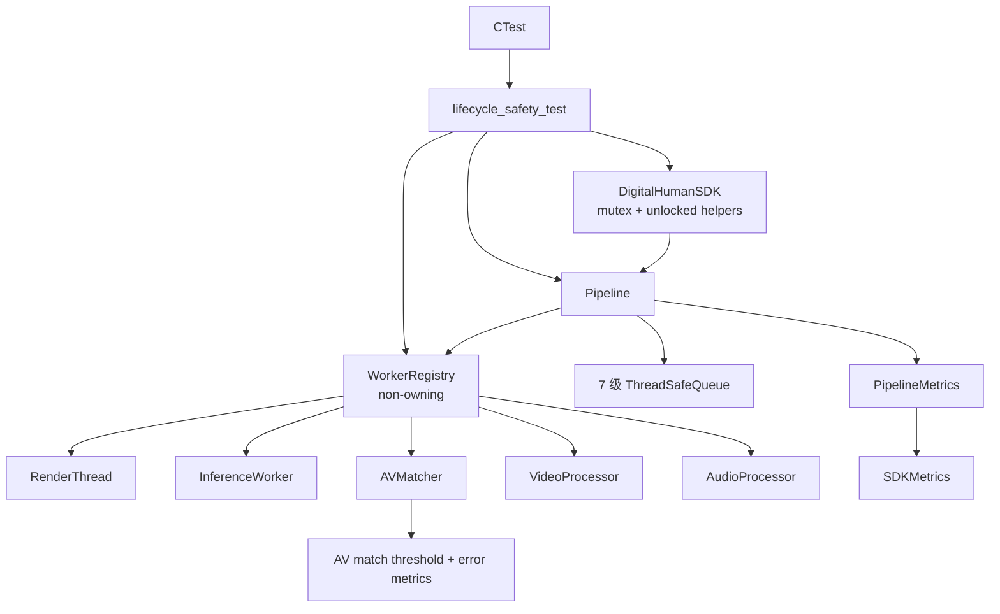
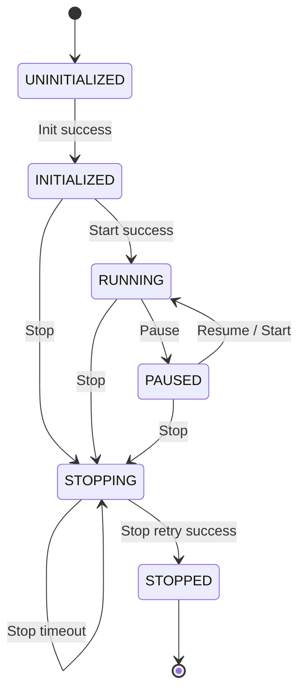

# 第二阶段改造：生命周期收敛、Worker Registry 与可观测性

> 实施日期：2026-08-11  
> 前置阶段：[第一阶段稳定性改造](phase1_stability_refactor.md)

## 1. 改造目标

第二阶段在第一阶段“线程必须可回收、停止超时可重试、配置边界一致”的基础上，继续解决以下问题：

1. SDK 使用 `std::recursive_mutex` 隐藏了公开接口之间的递归调用关系，生命周期逻辑不易审查；
2. SDK 同时维护 `SDKState` 与 `terminated`，存在两个生命周期事实来源；
3. Pipeline 对 worker 的启动、停止和等待仍依赖手写调用序列，新增 worker 时容易遗漏；
4. shutdown 只有成功/失败结果，缺少耗时、超时次数和具体 worker 等待结果；
5. 队列积压与音视频匹配偏差不可观测；
6. `av_match_threshold_ms` 已进入配置层，但此前没有实际约束 Matcher 输出；
7. 生命周期回归程序未接入 CTest，无法作为标准测试入口运行。

本阶段目标是让生命周期控制具备**单一状态来源、显式锁边界、统一 worker 编排、共享停止时限、可验证和可观测**的特性。

## 2. 总体设计



## 3. SDK 生命周期收敛

### 3.1 普通 mutex 替代 recursive_mutex

SDK 生命周期锁改为：

```cpp
mutable std::mutex lifecycle_mutex;
```

公开接口只负责获取一次锁，然后调用不重复加锁的私有 helper：

- `StartUnlocked()`；
- `StopUnlocked()`；
- `LoadLipSyncModelUnlocked()`；
- `LoadFaceModelUnlocked()`；
- `EnableGPUUnlocked()`；
- `SetInferenceThreadsUnlocked()`；
- `ValidateMutationUnlocked()`；
- `TransitionStateUnlocked()`。

`Init()` 自动加载模型、设置 GPU 和推理线程数时调用 unlocked helper；`ProcessFile()` 自动启动时调用 `StartUnlocked()`。这样消除了依靠递归锁才能成立的隐式调用关系。

### 3.2 SDKState 作为唯一事实来源

移除 SDK 层冗余的 `terminated` 原子变量。终止判断统一为：

```text
STOPPING 或 STOPPED => terminal
```

状态迁移如下：



`TransitionStateUnlocked()` 只在状态实际变化时写入状态并增加 `lifecycle_transition_count`，避免重复调用造成虚假迁移。

### 3.3 错误转换

生命周期和配置变更错误统一在 Impl helper 中转换：

- 未初始化：`NOT_INITIALIZED`；
- 已进入 `STOPPING/STOPPED`：`ALREADY_TERMINATED`；
- 运行中修改模型/GPU/线程参数：`ALREADY_RUNNING`；
- Pipeline 启动失败：`PIPELINE_START_FAILED`；
- Stop 超时：`SHUTDOWN_TIMEOUT`，状态保持 `STOPPING`，允许重试。

数据 Push/Pop 和指标查询仍只短暂持有 SDK 生命周期锁；阻塞队列操作不在锁内执行，避免 Stop 被长期阻塞。

## 4. WorkerRegistry

新增：

- `include/core/worker_registry.h`；
- `src/core/worker_registry.cpp`。

Registry 不拥有 worker，所有权仍由 Pipeline 中的 `std::unique_ptr` 保持。Pipeline 按实际启动顺序注册：

1. RenderThread；
2. InferenceWorker；
3. AVMatcher；
4. VideoProcessor；
5. AudioProcessor。

启动按注册顺序进行，使下游消费者先于上游生产者就绪；停止请求和等待按逆序进行，使上游先停止生产，再逐级回收下游。

### 4.1 部分启动失败回滚

`StartAll()` 记录本次由 Registry 成功启动的 worker 数量。当后续 worker 启动失败或抛出异常时：

1. 对已启动 worker 逆序发送 Stop；
2. 对已启动 worker 逆序无限 Wait；
3. 返回失败，不遗留后台线程。

预先由调用方启动、因而导致 `Start()` 返回 false 的 worker 不会被 Registry 接管所有权或擅自回收。

### 4.2 共享 shutdown deadline

`WaitAllFor(timeout_ms)` 在入口只计算一次绝对 deadline。每个 worker 获得的是剩余时间，而不是完整 timeout：

```text
remaining = max(0, shared_deadline - now)
```

因此 N 个阻塞 worker 的总等待时间接近一个 timeout，而不是 `N × timeout`。超时后线程仍由原对象持有，可再次调用 `WaitAllFor()`；析构路径使用 `WaitAll()` 最终 join，禁止 detach。

`WorkerShutdownReport` 提供：

- 是否全部停止；
- 整组 worker 的总等待时间；
- 每个 worker 的名称、停止结果和等待耗时。

## 5. Pipeline 生命周期与停止指标

Pipeline 的 Start/Stop/Wait 已统一委托给 WorkerRegistry。Stop 顺序保持为：

1. 标记 `stop_requested`，关闭输入；
2. 发送 Audio/Video EOS；
3. Stop 七级队列，唤醒阻塞 Push/Pop；
4. Registry 逆序请求 worker Stop；
5. 使用共享 deadline 等待全部 worker；
6. 全部退出后才标记 `terminated`。

有限时间 Stop 超时不会 detach，也不会伪装成成功。调用方可再次 Stop；Pipeline 析构时会无限等待并最终回收仍持有的线程。

新增 Pipeline 指标：

| 指标 | 含义 |
|---|---|
| `lifecycle_transition_count` | Pipeline 生命周期迁移次数 |
| `shutdown_attempt_count` | Stop 实际等待尝试次数 |
| `shutdown_timeout_count` | Stop 超时次数 |
| `last_shutdown_ms` | 最近一次 Stop 等待耗时 |
| `max_shutdown_ms` | 历史最大 Stop 等待耗时 |

## 6. 队列深度指标

`PipelineMetrics` 与 `SDKMetrics` 均增加七级队列的当前深度和历史峰值：

- `audio_raw`；
- `mel_features`；
- `video_raw`；
- `processed_faces`；
- `inference_tasks`；
- `inference_output`；
- `output_frames`。

这些指标直接读取各 `ThreadSafeQueue::GetMetrics()` 快照，可用于识别：

- 输入速度超过处理速度；
- 人脸检测或推理成为瓶颈；
- 渲染/消费不及时导致输出积压；
- 队列容量是否设置过大或过小。

SDK 的 `lifecycle_transition_count` 表示 SDK 自身状态机；shutdown、AV 匹配和队列指标由 Pipeline 映射。

## 7. AV Matcher 阈值接入

Matcher 以视频帧为驱动，根据视频 PTS 计算期望 Mel 窗口起点：

```text
expected_start = round(face_pts_ms / hop_ms)
```

再在当前可用 Mel 起点范围内选择最近值 `matched_start`，并计算：

```text
match_error_ms = abs(face_pts_ms - matched_start × hop_ms)
```

当：

```text
match_error_ms > av_match_threshold_ms
```

当前人脸帧不会生成推理任务，并记为一次 AV match miss。等于阈值仍允许匹配；配置为 0 时表示只允许时间戳精确对齐。

新增指标：

- `av_match_count`；
- `av_match_miss_count`；
- `avg_av_match_error_ms`；
- `max_av_match_error_ms`。

该阈值主要约束音频边界、视频明显滞后或历史 Mel 已被裁剪时的近似匹配；正常流中若目标窗口可被完整拉取，误差通常接近 0。

## 8. 测试与 CTest

`examples/lifecycle_safety_test.cpp` 在第一阶段测试基础上增加：

1. 两个不可协作停止的测试 worker 共享 40 ms deadline，总耗时不会叠加为两倍；
2. 第一次等待超时后释放 worker，再次 Wait 可以成功；
3. WorkerRegistry 部分启动失败时回滚并 join 已启动 worker；
4. Pipeline 初始化后生命周期迁移指标大于 0；
5. 七级队列初始深度均为 0；
6. Stop 后 shutdown attempt 和 latency 指标可查询；
7. SDK 状态迁移计数符合 `INITIALIZED → STOPPING → STOPPED`；
8. SDK 能映射 Pipeline shutdown 指标。

根 CMake 已启用 `CTest`，测试注册名为：

```text
lifecycle_safety
```

执行命令：

```bash
cmake --build build-wsl-phase2 --target lifecycle_safety_test --parallel 4
ctest --test-dir build-wsl-phase2 -R lifecycle_safety --output-on-failure
```

## 9. 验收结果

截至 2026-08-11，WSL CPU-only 环境已完成：

- `digital_human_core` 编译通过；
- `lifecycle_safety_test` 编译通过；
- CTest `lifecycle_safety` 通过；
- 1/1 测试成功。

构建环境未发现新的编译错误。现有 `RenderThread::Run()` 中 `t0` 未使用警告属于既有问题，不在本阶段范围内。

## 10. 后续建议

1. 将 `WorkerShutdownReport` 接入结构化日志或遥测后端，输出具体超时 worker；
2. 为 AV 匹配起点选择提取纯函数单元测试，覆盖音频起点、末尾和严格阈值；
3. 为队列深度增加周期采样与分位数，而不只保留瞬时值和峰值；
4. 增加真实模型的小规模端到端测试，验证 AV miss 与画面输出之间的关系；
5. 将完整 examples 的 FFmpeg 4.x/5+ `ch_layout` 兼容问题独立修复后纳入全量 CTest。