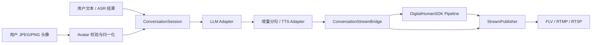
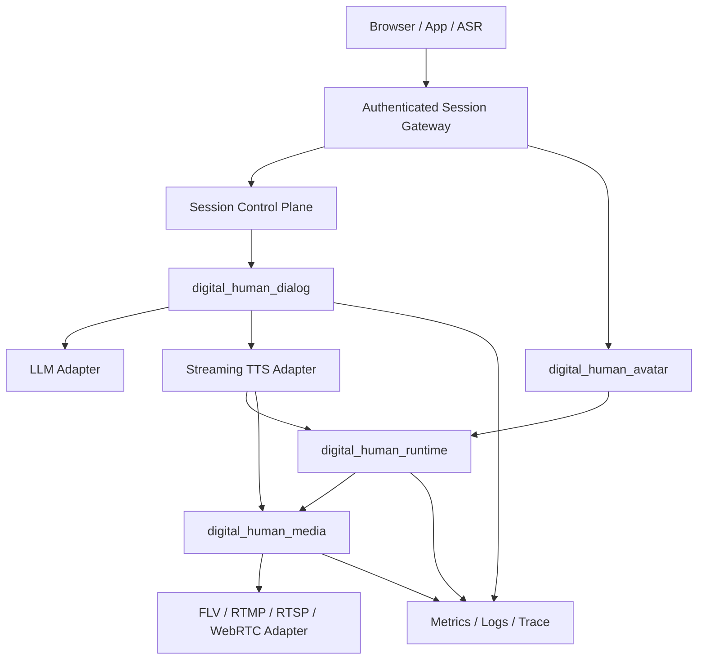

# Digital Human SDK 项目完善方案与实施路线

> 文档日期：2026-08-11  
> 文档状态：实施建议  
> 适用范围：当前 `DigitalHumanSDK`、实时头像会话、HTTP 文本/TTS 适配、媒体编码发布及工程基础设施

## 1. 结论与项目定位

项目已经完成从音频、静态头像到 Wav2Lip 推理、画面融合和 H.264/AAC 输出的核心闭环，并进一步实现了：

- OpenAI-compatible/llama.cpp 增量文本生成；
- 增量分句、HTTP TTS 和多线程会话编排；
- JPEG/PNG 上传校验、BGR 归一化和运行中头像热更新；
- TTS PCM、数字人视频帧到 FLV、RTMP、RTSP 的编码发布；
- SDK/Pipeline 一次性生命周期、Worker Registry、统一停止时限和运行指标；
- 单轮与多轮真实链路验收。

当前项目应定位为：**真实链路已经验证的功能型 MVP**。它已经能够用于演示、算法验证和内部集成，但在可复现构建、自动测试、实时故障收敛、稳定 ABI、发布打包和公网服务边界方面仍未达到生产级 SDK 标准。

近期工作重点应从继续堆叠功能，转向建立稳定工程基线、收紧实时链路契约和完善交付能力。

## 2. 当前架构



核心分层如下：

| 层次 | 当前职责 | 主要目录 |
|---|---|---|
| 应用入口 | 单轮验证、多轮终端会话、命令行参数 | `examples/` |
| 会话编排 | 文本生成、分句、TTS、音视频供料、打断 | `include/dialog/`、`src/dialog/` |
| 服务适配 | HTTP、llama.cpp、TTS PCM 契约 | `include/network/`、`include/tts/`、对应 `src/` |
| 头像入口 | 上传格式、大小、像素和所有权校验 | `include/avatar/`、`src/avatar/` |
| 数字人核心 | 音频、视频、人脸、匹配、推理、融合和同步 | `include/core/`、`src/core/`、`src/model/` |
| 媒体桥接 | 会话 PCM 和 SDK BGR 帧的分流 | `include/media/conversation_stream_bridge.h` |
| 编码发布 | H.264、AAC、mux、FLV/RTMP/RTSP | `include/media/stream_publisher.h`、`src/media/` |

### 2.1 已核验基线

- `avatar_upload`、`dialog_module`、`lifecycle_safety` 已有通过记录；
- 现有 `full_chain_face.flv`、`full_chain_uploaded_avatar.flv`、`realtime_multi_turn.flv` 等产物均可由 `ffprobe` 识别出 H.264 视频与 48 kHz AAC 音频；
- Pipeline 已直接组合 `AudioProcessor`、`VideoProcessor`、`InferenceWorker`、`RenderThread` 和 `WorkerRegistry`，历史上的重复 worker 实现问题已基本收敛；
- 上传头像、运行中头像更新和多轮对话已存在代码与测试入口；
- 文档中的实时头像链路与当前代码整体一致。

## 3. 问题清单与优先级

### 3.1 P0：版本与构建基线不可稳定复现

#### 现状

1. 当前工作区存在大量未提交源码、文档、构建目录和媒体产物，实时会话改造尚未形成清晰的可回滚版本。
2. `.gitignore` 只覆盖 `build/`、`build_wsl/` 等固定名称，没有覆盖 `build-wsl-phase*`、`build-windows-phase*` 和 `artifacts/`。
3. `build.sh` 会在用户目录创建动态库链接并直接修改生成的 `build.make`，依赖具体 Linux 路径和生成器实现。
4. `CMakePresets.json` 包含本机绝对盘符和依赖路径，不能直接用于其他开发机。
5. Windows 当前本地构建缓存仍存在 `ncnn_DIR-NOTFOUND`，缺少稳定的 Windows 依赖安装闭环。
6. README 声明 MIT License，但仓库根目录没有 LICENSE 文件。

#### 风险

- 新开发者无法从干净克隆稳定还原环境；
- 构建结果难以追溯，出现回归时无法快速定位提交；
- 构建产物和大媒体文件可能被误提交；
- 发布包无法证明其来源、配置和依赖版本。

#### 改进措施

- 将当前改动拆分为生命周期、头像、会话、推流、文档等独立提交；
- 使用通配规则忽略全部 CMake 构建树和本地媒体产物；
- 将机器专用配置移入不提交的 `CMakeUserPresets.json`；
- 提供可移植的 Linux CPU-only 和 Windows Vulkan preset；
- 使用 vcpkg manifest、Conan lockfile 或明确版本的依赖脚本，避免修补 `build.make`；
- 增加 LICENSE、CHANGELOG 和发布版本规则；
- 每个发布产物记录 Git commit、CMake 配置、编译器和依赖版本。

### 3.2 P0：测试体系不能作为可靠门禁

#### 现状

- `examples/` 下有 51 个 `*_test.cpp`，但当前只有 3 个测试注册到 CTest；
- 所有测试均为独立 `main()`，部分断言宏在多个文件中重复；
- `run_tests.sh` 统计失败数量后没有以非零状态退出，CI 可能把失败误判为成功；
- 离线测试、模型测试、网络测试、视觉检查和性能基准没有统一标签；
- 尚无 AddressSanitizer、UndefinedBehaviorSanitizer、ThreadSanitizer、覆盖率或 fuzz 门禁；
- WSL 构建目录在 Windows 直接运行 CTest 时路径不可用，跨环境执行方式没有固化。

#### 改进措施

- 所有无外部依赖的测试注册为 CTest；
- 使用 `unit`、`integration`、`model`、`network`、`visual`、`perf` 标签分层；
- 修正脚本退出码，任何非预期失败都必须阻断流水线；
- 抽取统一测试工具，或逐步迁移到 Catch2/GoogleTest；
- Linux CI 默认执行 CPU-only unit 测试和 ASan/UBSan；
- 并发模块定期运行 TSan；
- 对头像解码、SSE 分帧和 JSON 输入增加 fuzz 测试；
- 外部模型、TTS 和推流服务测试保留为显式的 nightly/manual job。

### 3.3 P0：TTS 尚非真正流式

#### 现状

`HttpTTSClient` 会把完整 HTTP 响应保存到 `std::vector<uint8_t>`，请求完成后才转换并分发 PCM chunk。当前的 chunk 只是内存二次切片，并不能缩短首音频延迟。

#### 风险

- 文档中的 TTS 首包和 SDK 首帧延迟预算无法稳定实现；
- 长文本回复增加内存峰值；
- 用户打断只能取消尚未完成的 HTTP 请求，已下载的大响应造成浪费。

#### 改进措施

- 在 libcurl write callback 中增量解析 PCM；
- 保留不足一个 sample/frame 的尾部字节，完整 chunk 立即回调；
- 引入最大响应体、最大音频时长和最大单句长度；
- 校验响应 Content-Type 和可选音频元数据；
- 将首字节、首 PCM、合成总时长写入指标；
- 若正式 TTS 支持 WebSocket/HTTP chunked streaming，增加独立适配器，而不修改会话层。

### 3.4 P0：错误、取消与停止语义未完全闭环

#### 现状

- 视频供料失败后只触发错误回调，没有让当前 turn 进入失败终态；
- Bridge 输出线程发生发布器错误时只记录 `last_error` 并退出，Session 不一定立即停止继续供料；
- `ConversationSession::Stop()` 先等待固定 30 秒，再执行无超时 `join()`；
- `StreamPublisher::PushAudio()` 在音频队列满时无界等待；
- SDK、会话、Bridge 和 Publisher 各自维护停止状态，但缺少贯穿全链路的取消令牌和统一截止时间。

#### 风险

- 网络、编码器或 SDK 故障可能造成重复错误、长时间停止或局部线程退出；
- 调用者收到错误回调后无法判断该 turn 是否仍在运行；
- 资源回收时间没有统一上界。

#### 改进措施

- 引入明确的会话状态机：

```text
IDLE → GENERATING → SYNTHESIZING → PLAYING → IDLE
          │              │             │
          └──────────────┴─────────────┤
                                       ▼
                                INTERRUPTING
任意活动状态 → FAILED / STOPPING → STOPPED
```

- LLM、TTS、SDK、Publisher 的不可恢复错误只能产生一次终态事件；
- Session 接收到媒体终端错误后立即取消当前 LLM/TTS 和剩余 PCM；
- 所有阻塞 Push/Pop 接受 stop token 和 deadline；
- Stop 使用一个共享 deadline，并返回明确的成功、超时或失败结果；
- 增加断网、发布器阻塞、TTS 卡住、SDK 输出停止等故障注入测试。

### 3.5 P0：头像热更新缺少统一画布契约

#### 现状

CLI 会把后续头像缩放到初始编码画布，但 `ConversationSession::UpdateAvatar()` 公开 API 只做通道归一化和 clone，没有保证尺寸与初始头像一致。

#### 风险

未来 HTTP/multipart 网关若直接调用该 API，不同尺寸头像可能改变 SDK 输出尺寸，而已经打开的 H.264 编码流不能在中途任意变更分辨率。

#### 改进措施

- 在 Session 启动时固定 `avatar_canvas_size`；
- `UpdateAvatar()` 内部根据配置执行 `reject`、`fit` 或 `cover`；
- 明确缩放、裁剪和背景填充策略；
- 强制输出偶数宽高；
- 头像元数据记录原始尺寸、画布尺寸和变换方式；
- 测试横图、竖图、极小图、奇数尺寸和连续快速更新。

### 3.6 P0：上传与 HTTP 资源限制仍需加强

#### 现状

- 头像编码大小在解码前检查，但宽高和像素总量在 `cv::imdecode` 后检查；
- HTTP Transport 没有统一的最大响应体和低速超时；
- 当前客户端可接受调用者提供的任意 URL，未来网关直接透传 URL 时存在 SSRF 风险；
- EXIF orientation 尚未处理。

#### 改进措施

- 在可行时先解析 JPEG/PNG header 获取尺寸，再决定是否进入完整解码；
- 高安全等级部署使用隔离解码进程或受限图像库；
- 为 HTTP 请求增加 body 上限、低速阈值、DNS/连接策略和重定向策略；
- 网关端使用服务白名单，不允许用户直接指定 LLM/TTS/推流目标；
- 补充 EXIF orientation 策略；
- 网关增加认证、上传限频、会话配额、请求超时和审计日志。

### 3.7 P1：单体库耦合过高

#### 现状

当前全部源码被编译进单一 `digital_human_core` 共享库，OpenCV、ncnn、FFmpeg、PortAudio 和 OpenMP 大量作为公共依赖传播。即使调用方只需要头像校验或纯推理，也需要准备完整依赖。

#### 目标模块

| Target | 职责 | 主要依赖 |
|---|---|---|
| `digital_human_runtime` | Pipeline、模型推理、同步和渲染 | OpenCV、ncnn、OpenMP |
| `digital_human_avatar` | 图片校验、解码和画布适配 | OpenCV imgcodecs/imgproc |
| `digital_human_dialog` | 会话状态机和分句 | C++ 标准库 |
| `digital_human_http` | HTTP 文本/TTS 适配 | libcurl，可选 |
| `digital_human_media` | H.264/AAC 编码和发布 | FFmpeg，可选 |
| `digital_human_audio_io` | 本机音频播放 | PortAudio，可选 |
| `digital_human_sdk` | 对外稳定门面 | 组合上述模块 |

#### 改进措施

- 显式列出源文件，避免继续扩大 `GLOB_RECURSE` 的隐式边界；
- 增加 `BUILD_SHARED_LIBS`、`BUILD_EXAMPLES`、`ENABLE_HTTP`、`ENABLE_MEDIA`、`ENABLE_AUDIO_IO`；
- 依赖只在真正需要的 target 上使用 `PRIVATE/PUBLIC`；
- examples 默认不参与 SDK 最小构建；
- 为模块建立依赖方向检查，禁止 core 反向依赖 dialog/media。

### 3.8 P1：缺少正式 SDK 安装、ABI 与版本策略

#### 现状

- 没有 `install()`、CMake package export、pkg-config 或稳定发布包；
- 共享库没有 `VERSION/SOVERSION` 和 Windows 导出宏；
- 公共接口暴露 `cv::Mat`、`std::vector`、`std::string`，部分模块直接暴露 ncnn 类型；
- 各子模块分别使用 `bool + string`、枚举错误码和控制台日志，错误体系不统一。

#### 改进措施

- 提供 `DigitalHumanSDKConfig.cmake` 和 `find_package(DigitalHumanSDK)`；
- 安装公共头、共享库、许可证和最小示例；
- 增加 Windows `DIGITAL_HUMAN_API` 导出宏；
- 制定语义化版本和 ABI 兼容政策；
- 对跨编译器和跨语言使用提供版本化 C API：opaque handle、POD 配置、显式 buffer 生命周期；
- C++ API 可保留为便捷封装，但不承诺跨编译器 ABI；
- 统一错误结构：错误码、模块、可读消息和底层原因。

### 3.9 P1：可观测性尚不足以支撑生产定位

#### 现状

Pipeline 已有队列、推理和生命周期指标，但会话、HTTP、TTS、Bridge 和发布器缺少一致的 turn 级追踪。库内部仍存在大量直接输出到 `stdout/stderr` 的日志。

#### 建议指标

| 类别 | 指标 |
|---|---|
| 会话 | session/turn 数、状态、成功/失败/打断数、历史长度 |
| LLM | 首 token、tokens/s、总耗时、取消耗时、HTTP 状态 |
| TTS | 首字节、首 PCM、实时率、输出样本数、失败次数 |
| Avatar | 解码耗时、原始/画布尺寸、拒绝原因、更新次数 |
| Pipeline | 各级队列当前/峰值、处理 p50/p95/p99、AV drift |
| Publisher | 编码 p95、丢帧原因、音频反压、重连和 packet 数 |
| 生命周期 | Start/Stop 耗时、超时 worker、资源峰值 |

#### 改进措施

- 所有日志携带 `session_id`、`turn_id` 和模块名；
- 提供日志回调或 logger interface，SDK 不直接决定输出位置；
- 区分 debug、info、warn、error；
- 指标提供快照 API，并可由上层转换为 Prometheus/OpenTelemetry；
- E2E 测试保存机器、配置、模型版本和完整阶段延迟。

### 3.10 P1：多轮对话仍缺少产品级能力

#### 当前边界

- 用户输入仍以终端文本为主；
- 没有 ASR、VAD 驱动的用户抢话和完整 barge-in；
- 没有浏览器 UI、multipart Server、用户体系和会话网关；
- Conversation history 会随多轮对话持续增长，没有 token/轮次预算；
- 本地 Windows TTS/eSpeak 适合验收，不代表生产音色质量。

#### 改进措施

- 增加 ASR 接口和 partial/final transcript 事件；
- VAD 触发时停止当前 TTS、清理未编码音频，并重新对齐时间轴；
- 对 history 增加轮次、字符/token 上限和摘要策略；
- 建立独立 Web Gateway，SDK 保持媒体引擎定位；
- 网关负责 multipart、认证、租户配额、会话租约和目标地址白名单；
- 正式 TTS 使用独立适配器接入，保持统一 PCM 流式契约。

### 3.11 P2：推流恢复与媒体时钟需要长期强化

建议补充：

- RTMP/RTSP 断线检测、指数退避和最大重连窗口；
- 重连期间视频丢帧、音频保留或会话失败的明确策略；
- 编码器能力探测、硬件设备选择和软件回退；
- 独立媒体时钟、抖动统计和长会话漂移校正；
- 视频队列按实时延迟而非单纯帧数控制；
- 网络慢消费者和磁盘写满的故障测试。

### 3.12 P2：质量和性能门禁尚未形成发布标准

现有工具已经能够统计 p95/p99、PSNR 和 SSIM，但尚未成为自动发布门禁。像素指标也不能直接代表口型同步质量。

建议建立固定测试集并记录：

- 首 token、首 PCM、首数字人帧和首编码 packet；
- 端到端 FPS、p50/p95/p99、丢帧率和内存峰值；
- A/V 时间戳单调性和音视频时长差；
- 嘴部区域 PSNR/SSIM、非嘴部变化上限；
- SyncNet/LSE 类口型同步指标；
- CPU 1/2/4 线程和 GPU/Vulkan 性能矩阵；
- 30 分钟多轮 soak test；
- INT8/FP16 模型的质量、延迟和回退结果。

## 4. 目标架构

建议将“SDK 媒体引擎”和“公网会话服务”明确分离：



边界原则：

1. SDK 不负责公网认证和用户体系；
2. Gateway 不直接操作 ncnn、FFmpeg 内部对象；
3. LLM/TTS/Publisher 都通过可取消接口注入；
4. Session 状态机是 turn 成功、失败、打断和停止的唯一事实来源；
5. 音频是媒体主时钟，编码层不重新解释会话 PTS；
6. 头像更新只替换最新快照，始终服从固定画布；
7. 指标和错误贯穿 session、turn 和媒体链路。

## 5. 分阶段实施路线

### M0：冻结和清理工程基线（2–3 天）

#### 交付内容

- 拆分并提交当前实时会话相关改动；
- 补全 `.gitignore`；
- 移出本地构建目录与媒体产物；
- 增加 LICENSE 和 CHANGELOG；
- 修复 `run_tests.sh` 失败退出码；
- 增加干净克隆构建说明；
- 区分 portable preset 与 user preset。

#### 完成标准

- `git status` 在构建前后保持无非预期文件；
- 新机器可按文档完成 Linux CPU-only 配置；
- 构建失败不会修改用户系统目录或生成文件；
- 测试失败时脚本返回非零状态。

### M1：建立自动测试和安全门禁（1 周）

#### 交付内容

- 注册全部离线测试到 CTest；
- 增加测试 label 和超时；
- Linux CPU-only CI；
- ASan/UBSan job；
- 头像、SSE 和 JSON fuzz target；
- 模型/网络测试作为手动或 nightly job；
- 测试结果与关键媒体产物作为 CI Artifact。

#### 完成标准

- 离线 CI 不依赖模型、GPU、音频设备或网络；
- 任一测试失败可靠阻断；
- CTest 能按 label 单独运行；
- 头像恶意输入不会造成未受控异常或超额资源使用；
- sanitizer 无已知错误。

### M2：收紧实时会话正确性（1–2 周）

#### 交付内容

- 真正流式的 TTS PCM；
- Session 显式状态机；
- 统一 stop token、deadline 和终态错误；
- Publisher/Bridge 错误向 Session 传播；
- 固定头像画布和更新策略；
- HTTP 响应体、低速和 Content-Type 限制；
- history 预算；
- 故障注入测试。

#### 完成标准

- 首 PCM 在服务返回首个完整 chunk 后立即送入 SDK；
- 打断后不再提交旧 turn 的音频和视频；
- Stop 在配置的时间上界内返回明确状态；
- 任一不可恢复媒体错误只产生一次 turn 失败；
- 任意合法头像更新不改变编码分辨率；
- 长回复不会导致无界内存增长。

### M3：完成 SDK 模块化和可安装发布（2 周）

#### 交付内容

- 拆分 runtime/avatar/dialog/http/media/audio_io targets；
- 可选依赖和最小构建；
- `install()` 和 CMake package export；
- Windows 导出宏；
- VERSION/SOVERSION；
- 版本化 C API 和 C++ wrapper；
- 外部 consumer 示例。

#### 完成标准

- 独立示例仓库能通过 `find_package(DigitalHumanSDK)` 构建；
- 不启用 media/http/audio_io 时不要求对应依赖；
- Windows 和 Linux 发布包均包含头文件、库、许可证和示例；
- ABI 检查纳入发布流程；
- 公共头不泄漏不必要的第三方内部类型。

### M4：产品化会话入口（2–4 周）

#### 交付内容

- HTTP/multipart 会话网关；
- API key/OAuth、租户和会话配额；
- ASR 与 VAD；
- 用户抢话和完整 barge-in；
- 正式流式 TTS 适配；
- 浏览器或业务服务示例；
- 会话日志、审计和指标导出。

#### 完成标准

- 浏览器或业务客户端可以创建、更新头像、提交文本/语音和关闭会话；
- 未认证请求、超额上传和非法目标地址被拒绝；
- 用户抢话后旧回复在限定时间内停止；
- 多会话资源隔离可验证；
- 网关重启和客户端断开有明确清理策略。

### M5：生产媒体与持续性能优化（持续）

#### 交付内容

- RTMP/RTSP 重连和背压策略；
- Windows/Linux CPU/GPU 构建矩阵；
- GPU/Vulkan 能力探测和自动回退；
- 静态头像预计算、嘴部 ROI、减少图像复制；
- 模型量化质量门禁；
- 性能基线、长稳和回归看板。

#### 完成标准

- 30 分钟多轮会话无泄漏、死锁和持续漂移；
- 网络抖动或短暂断开后的行为符合配置；
- p95/FPS/内存和口型质量均满足发布阈值；
- CPU/GPU 回退不会破坏输出格式和会话状态；
- 每个发布版本都有可追溯性能与质量报告。

## 6. 建议的首批提交顺序

为降低当前工作区继续叠加变更的风险，建议按以下顺序提交：

1. `chore(repo)`：忽略规则、LICENSE、preset 和构建脚本；
2. `test(ctest)`：统一测试注册、label、退出码和 CI；
3. `fix(session)`：错误终态、取消令牌和停止 deadline；
4. `feat(tts)`：流式 PCM 与 HTTP 资源限制；
5. `fix(avatar)`：固定画布、尺寸策略和解码前检查；
6. `refactor(cmake)`：模块化 target 和可选依赖；
7. `feat(package)`：install/export、版本和 C API；
8. `feat(gateway)`：认证会话网关、ASR 和 barge-in；
9. `perf(release-gate)`：GPU、长稳、质量和性能门禁。

每个提交应只解决一类问题，配套测试和文档必须与实现同时提交。

## 7. 发布完成定义

只有满足以下条件，项目才可声明为可发布 SDK：

### 工程与构建

- 干净克隆可以在支持的平台完成配置、构建和安装；
- 依赖版本、编译器和构建选项可追溯；
- CI 覆盖 Linux CPU-only，并至少验证一个 Windows 配置；
- LICENSE、版本号、CHANGELOG 和发布包完整。

### 正确性与稳定性

- 全部离线测试和 sanitizer 通过；
- 真实模型端到端输出包含有效 H.264/AAC；
- PTS 单调、音视频时长差和 AV drift 符合阈值；
- Stop、Interrupt、服务失败和断网都有明确终态；
- 30 分钟多轮长稳测试无泄漏、死锁和队列无限增长。

### 安全

- 上传大小、格式、尺寸、像素、频率和解码资源均受限；
- 网关有认证、配额、目标白名单和审计；
- HTTP 响应体、超时、重定向和低速连接策略明确；
- fuzz 测试覆盖上传、SSE 和 JSON 入口。

### 性能与质量

- 首 token、首 PCM、首帧、首 packet 有稳定测量；
- FPS、p95/p99、丢帧率和内存满足部署目标；
- 口型同步指标和人工审片均通过；
- GPU/CPU 切换和模型量化有质量回归结果。

### SDK 交付

- `find_package` consumer 示例可用；
- 公共 API、错误码、线程安全和所有权契约有文档；
- Windows/Linux 发布包可被外部项目使用；
- ABI 和兼容性政策明确。

## 8. 当前最推荐的执行范围

近期应优先完成 M0、M1 和 M2。这三阶段不要求立即引入浏览器、ASR 或新模型，但能把项目从“可演示的功能原型”提升为“可持续集成、可回归、实时行为可预测的 SDK”。

M3 解决正式交付，M4 解决产品入口，M5 建立生产运行和持续优化能力。若资源有限，应严格按此顺序推进，避免在测试、生命周期和发布基线尚未稳定时继续扩大功能面。

## 9. 相关文档

- [架构总览](overview.md)
- [第一阶段稳定性改造](phase1_stability_refactor.md)
- [第二阶段生命周期与可观测性改造](phase2_lifecycle_observability_refactor.md)
- [用户图片驱动的实时数字人会话实现方案](realtime_avatar_conversation_implementation.md)
- [实时头像数字人会话运行指南](../guides/realtime_avatar_conversation.md)
- [端到端验收指南](../guides/end_to_end_validation.md)
- [性能优化计划](../perf/performance_optimization_plan.md)
- [模型精度与量化指南](../models/model_precision_quantization_guide.md)
