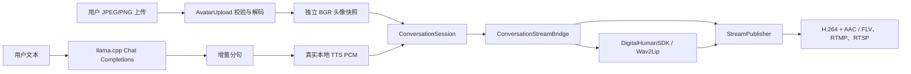

# 用户图片驱动的实时数字人会话实现方案

> 文档日期：2026-08-11  
> 目标：在现有 `llama.cpp → HTTP TTS → DigitalHumanSDK → H.264/AAC` 链路上，增加安全的用户图片上传、运行中头像更新、真实语音服务和可重复的端到端验收。

## 1. 当前基线

项目已经具备以下可复用能力：

- `LlamaCppTextGenerationClient`：调用 OpenAI-compatible `/v1/chat/completions`，支持 SSE 增量输出；
- `ConversationSession`：负责文本生成、分句、TTS、音视频时钟和打断；
- `HttpTTSClient`：接收 16 kHz 单声道 PCM；
- `DigitalHumanSDK`：SCRFD/2D106 人脸处理和 Wav2Lip 推理；
- `ConversationStreamBridge`：把 TTS PCM 同时送入 SDK 和发布器，并拉取数字人帧；
- `StreamPublisher`：编码 H.264/AAC，支持本地 FLV、RTMP 和 RTSP。

2026-08-11 已完成真实 llama.cpp 验证：

- 进程：`E:\llama.cpp\llama-server.exe`；
- 模型：`E:\llama.cpp\models\Qwen3-4B-Q4_K_M.gguf`；
- 地址：`http://127.0.0.1:8090`；
- `/health` 返回 `{"status":"ok"}`；
- `/v1/models` 返回 Qwen3-4B 模型；
- `/v1/chat/completions` 对“请只回复：链路正常”真实返回“链路正常”。

当前缺口：

1. 头像入口仍以调用者直接传入 `cv::Mat` 为主，缺少对上传字节的格式、安全和资源限制；
2. 会话启动后缺少线程安全的头像更新 API；
3. 项目只有 TTS HTTP 客户端和测试 mock，没有可直接启动的真实本地 TTS 服务；
4. 真实全链路示例固定使用 `assets/face.jpg`，无法直接验收用户上传图片；
5. 离线单元测试尚未覆盖上传攻击面和头像所有权。

## 2. 改造目标

### 2.1 功能目标

- 接收 JPEG/PNG 编码字节，不信任上传文件名；
- 校验 Content-Type、文件签名、编码大小、宽高和总像素数；
- 将灰度、BGR、BGRA 统一为独立拥有内存的 `CV_8UC3 BGR`；
- 支持从持久化文件加载，也支持 HTTP/multipart 层直接传入内存字节；
- 会话运行时可更新头像，更新只影响后续送入 SDK 的视频帧；
- 完整链路测试允许显式传入用户头像路径和用户问题；
- 提供真实本地 TTS 服务，输出现有 `HttpTTSClient` 所需的裸 PCM；
- 输出可由 `ffprobe` 验证的 H.264/AAC FLV。

### 2.2 非功能目标

- 上传内容不直接映射为服务器文件路径；
- 默认最大编码大小 10 MiB、最大边长 4096、最大像素 16 MP；
- `ConversationSession` 必须 clone 上传头像，不能引用调用方可变内存；
- 头像更新与视频线程之间无数据竞争；
- 所有工作线程可停止并 join；
- 离线测试不依赖模型、网络或 GPU；
- 真实测试与 CTest 单元测试分层，避免 CI 因外部服务不可用而误失败。

## 3. 目标架构



### 3.1 Avatar 模块

新增：

- `include/avatar/avatar_image.h`
- `src/avatar/avatar_image.cpp`

公开契约：

- `AvatarUploadLimits`：编码大小、宽高、总像素限制；
- `AvatarImageFormat`：JPEG/PNG；
- `AvatarImage`：归一化后的 BGR 和格式元信息；
- `DecodeAvatarUpload(...)`：供 multipart/HTTP 层直接传字节；
- `LoadAvatarImage(...)`：供 CLI、集成测试和持久化路径使用。

解码顺序：

1. 校验限制配置；
2. 拒绝空内容和超限内容；
3. 根据魔数识别 JPEG/PNG；
4. 若 Content-Type 非空，必须与魔数一致；
5. `cv::imdecode(..., IMREAD_UNCHANGED)`；
6. 校验宽高和像素数；
7. 灰度/BGRA 转 BGR；
8. clone 为连续、独立的 SDK 输入帧。

### 3.2 会话头像热更新

为 `ConversationSession` 增加：

```cpp
bool UpdateAvatar(const cv::Mat& avatar_frame);
```

实现约束：

- 空图或非 8-bit 1/3/4 通道输入返回 false；
- 输入归一化为 BGR 后 clone；
- 仅在已启动且未停止时接受更新；
- 视频线程在锁内获取 `cv::Mat` 引用计数快照，在锁外调用 sink；
- 由于新旧 Mat 均由引用计数管理，更新不会释放正在发送的旧帧；
- 不修改当前音频/文本任务，只影响后续视频帧。

### 3.3 真实本地 TTS

新增 `tools/windows_tts_service.ps1`，使用 Windows `System.Speech.Synthesis.SpeechSynthesizer`：

- `POST /tts`；
- 请求协议与 `HttpTTSClient` 一致；
- 生成 16 kHz、16-bit、mono PCM WAV；
- 去掉 WAV 容器头后返回 `application/octet-stream` 裸 PCM；
- 支持 `pcm_s16le`；
- 绑定 `127.0.0.1`，默认端口 `18080`；
- 单请求串行使用 synthesizer，避免 COM/语音对象并发问题。

该服务属于本机真实 TTS，不再使用正弦波 mock。若机器没有可用的 Windows 语音，启动时直接失败并报告可用 voice 列表。

### 3.4 真实全链路入口

扩展 `full_conversation_chain_test` 参数：

```text
full_conversation_chain_test <llama_url> <tts_url>
    [output_url] [file|rtmp|rtsp] [model] [avatar_path] [user_text]
```

- 默认头像仍为 `assets/face.jpg`；
- 显式头像通过 `LoadAvatarImage` 进入同一上传校验路径；
- 用户文本可配置；
- 失败时打印 LLM、TTS、SDK、bridge 或 publisher 的具体错误；
- 文件输出通过 FFmpeg API 检查 H.264/AAC、包数量、分辨率和采样率；
- 外部再使用 `ffprobe` 做独立验收。

## 4. 测试策略

### 4.1 离线单元测试

新增 `avatar_upload_test`，覆盖：

- 空上传；
- 非法 JPEG 字节；
- JPEG/PNG Content-Type 与魔数不一致；
- 编码大小限制；
- 解码宽高限制；
- 灰度转 BGR；
- BGRA 转 BGR；
- Content-Type 自动识别；
- 文件加载；
- 初始头像 clone；
- 运行中头像更新；
- 更新头像 clone；
- 空头像更新拒绝。

同时将现有 `dialog_module_test` 注册为 CTest，继续覆盖：

- 增量分句；
- LLM → TTS → sink；
- PTS 单调；
- 会话 busy/idle；
- interrupt 和 stop。

### 4.2 服务级测试

- `llama_cpp_client_test` 连接真实 `127.0.0.1:8090`；
- `http_service_client_test` 连接真实 Windows TTS；
- 校验 TTS PCM 非空、采样数量正确且不是恒定静音。

### 4.3 真实端到端测试

验收顺序：

1. llama `/health`、`/v1/models`、`/v1/chat/completions`；
2. Windows TTS `/health` 和 `/tts`；
3. 使用 `assets/face.jpg` 输出基线 FLV；
4. 使用另一张上传 JPEG/PNG 输出 FLV；
5. `ffprobe` 验证视频 H.264、音频 AAC、包数量和时长；
6. 抽帧检查输出确实使用上传头像；
7. 可选：将同一发布器 URL 改为 RTMP/RTSP 做网络发布验收。

## 5. 延迟与背压

目标首包延迟预算：

| 环节 | 目标 |
|---|---:|
| llama 首 token | 1.0 s 内（本机 Qwen3-4B） |
| 首句分段 | 0.5–1.5 s |
| TTS 首段 PCM | 1.5 s 内 |
| SDK 首帧 | 收到足够 mel 后 0.5 s 内 |
| 编码发布 | 200 ms 内 |

现有队列继续承担背压：

- `max_pending_audio_chunks` 限制会话 PCM；
- SDK 输入/输出队列限制推理积压；
- `StreamPublisher` 视频队列满时按既有策略统计丢帧；
- 打断时取消 LLM/TTS，清空尚未消费的句子和 PCM；
- 头像更新不排队，只保留最新快照。

## 6. 安全边界

- 仅允许 JPEG/PNG；
- 不根据用户文件名选择服务器路径；
- 文件 API 使用调用方明确提供的可信持久化路径；
- Web 层应把 multipart 内容直接交给 `DecodeAvatarUpload`；
- 默认仅监听环回地址；
- 若以后绑定 `0.0.0.0`，必须增加 API key、限流、请求超时和会话配额；
- 解码前限制编码字节，解码后再次限制像素，降低压缩炸弹风险；
- 当前不自动处理 EXIF orientation，调用端应在上传前校正，或后续单独引入可靠元数据解析器。

## 7. 实施顺序

1. 先提交测试契约并纳入 CTest；
2. 实现 Avatar 上传解码模块；
3. 实现 `ConversationSession::UpdateAvatar`；
4. 增加真实 Windows TTS 服务；
5. 扩展全链路示例参数；
6. 构建并运行离线测试；
7. 运行真实 llama + TTS + SDK + 编码链路；
8. 用第二张用户图片重复验收；
9. 补充运行指南、实测指标和已知限制。

## 8. 完成定义

只有以下条件全部满足，才可声明“终极目标完成”：

- 上传图片单元测试通过；
- 对话模块单元测试通过；
- 真实 llama.cpp 返回有效中文回复；
- 真实 TTS 返回可听语音 PCM；
- SDK 对上传头像产生数字人帧；
- 输出媒体同时包含 H.264 和 AAC；
- 输出文件可正常解码，音视频时间戳单调；
- 使用非默认上传图片再次通过；
- 文档给出可复制的启动、构建和验收命令。

## 9. Implementation and acceptance results

The implementation followed the required order: tests first, design second, implementation last.

1. Added and ran `avatar_upload_test`, and registered `dialog_module_test` with CTest.
2. Documented upload limits, ownership, concurrency, backpressure, cancellation, and acceptance criteria.
3. Implemented avatar decoding, runtime avatar replacement, real local TTS, single-turn E2E, and persistent multi-turn conversation.

Verified artifacts include:

- `artifacts/full_chain_face.flv`: default avatar, H.264 + AAC;
- `artifacts/full_chain_uploaded_avatar.flv`: uploaded PNG avatar, H.264 + AAC;
- `artifacts/realtime_multi_turn.flv`: two real conversation turns with a successful mid-session avatar update.

Offline tests `avatar_upload`, `dialog_module`, and `lifecycle_safety` passed. The multi-turn CLI supports local file output and publishing to an existing RTMP/RTSP media server.

A browser multipart server is intentionally not claimed as complete. The delivered boundary is the upload-byte API plus file/terminal entry points that can be wrapped by a future authenticated Web gateway.
