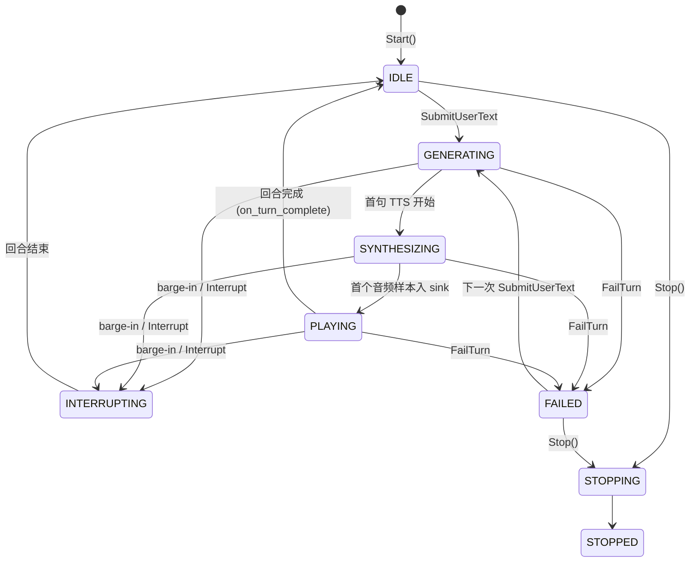

# Digital Human SDK 系统架构设计文档

> 版本：1.0（2026-08-30）
> 适用代码基线：分支 `codex/replace-dlib-with-scrfd`
> 本文是系统的顶层架构说明，覆盖会话编排、实时流水线、推流三大子系统，
> 并记录 2026-08 P0 修复引入的行为契约。模块级细节见 `docs/architecture/` 下各专题文档。

---

## 1. 系统总览

SDK 的目标是把"用户输入 → LLM 回复 → 语音合成 → 口型驱动 → 音视频推流"
做成一条低延迟、可容错的实时流水线。整体分为四层：

```text
┌─────────────────────────────────────────────────────────────────┐
│  接入层   C API (c_api.h) / C++ Facade (DigitalHumanSDK)         │
├─────────────────────────────────────────────────────────────────┤
│  会话层   ConversationSession（状态机编排）                       │
│           ├─ ITextGenerationClient  → llama.cpp / OpenAI 兼容服务 │
│           ├─ SentenceSegmenter      → 增量分句                    │
│           ├─ ITTSClient             → HTTP TTS (PCM s16le/f32le)  │
│           └─ IASRClient / IStreamingVAD（语音输入与打断，可选注入）│
├─────────────────────────────────────────────────────────────────┤
│  流水线层  Pipeline（音视频实时处理）                              │
│           音频: AudioProcessor → Mel 特征（Wav2Lip 前端规范）      │
│           视频: VideoProcessor → SCRFD 检测 → 2D106 对齐 → 口唇遮罩│
│           推理: InferenceWorker (ncnn, Vulkan 优先)               │
│           渲染: OutputProcessor 融合 → RenderThread 调度输出      │
├─────────────────────────────────────────────────────────────────┤
│  媒体层   ConversationStreamBridge → StreamPublisher             │
│           BGR+PCM → H.264/AAC → FLV / RTMP / RTSP                │
└─────────────────────────────────────────────────────────────────┘
```

四层之间只通过明确定义的数据契约交互：`Packet<T>`（include/core/packet.h）
携带 PTS、seq_id 与 StatusCode（OK/ERROR/FATAL/EOS/SKIP/TIMEOUT），
是贯穿流水线的统一数据单位。

---

## 2. 会话编排子系统

### 2.1 状态机

`ConversationSession`（include/dialog/conversation_session.h）按回合驱动：



### 2.2 回调契约（P0 修复后）

`ConversationCallbacks` 的调用顺序与次数保证：

| 回调 | 时机 | 次数 |
|------|------|------|
| `on_text_delta` | LLM 增量文本 | 0..N 次 |
| `on_reply_ready` | 完整回复拼装完成 | 0..1 次 |
| `on_error` | 不可恢复错误（turn_failed 去重） | 0..1 次 |
| `on_turn_complete` | **每个回合结束时（成功/被打断/失败均触发；失败时在 on_error 之后）** | **恰好 1 次** |

`on_turn_complete` 的失败补发是 P0 修复的关键行为：依赖该回调串联下一轮的
编排器在一次失败后不再停摆。状态恢复路径：FAILED 不是死终态，
下一次 `SubmitUserText` 会重置为 GENERATING。

### 2.3 多轮历史

用户/助手消息在内存中持久化并跨回合传递，按轮次（`max_history_turns`）、
字符（`max_history_chars`）、token 估算（`max_history_tokens_estimate`）
三重预算裁剪。历史不落盘、不可预置——会话级持久化是后续演进项。

### 2.4 线程模型与锁契约

会话内部有四个工作线程（generation / tts / audio / video）+ 一把会话互斥量。
P0 修复确立的锁契约（详见 examples/conversation_session_lock_test.cpp）：

1. **客户端 Start/Stop 在锁外调用。** `SetASRClient`/`SetStreamingVAD`
   在锁内只做指针替换与标志清理，Start/Stop 一律在锁外执行——
   ASR/VAD 实现可能在 Start 内同步触发回调（cancelled 检查、VoiceStart），
   回调会重取会话互斥量，持锁调用必然自死锁。
2. **PushUserAudio 锁内快照、锁外转发。** `asr_client`/`streaming_vad`
   指针及启动标志在锁内复制到局部变量，ASR/VAD 的音频推送在锁外进行——
   既消除数据竞争，又不让客户端内部处理阻塞会话状态。
3. **Stop 的回收路径同样先快照后调用**，与上面两条保持一致。

> 客户端生命周期由调用者管理（头文件契约）：调用者须保证注入期间指针有效，
> 并在 Stop 之前解除绑定或销毁。

### 2.5 barge-in（音频打断）

`enable_barge_in` 开启时，注入的 `IStreamingVAD` 检测到用户语音（VoiceStart）
即触发 `OnBargeIn`：取消当前 LLM/TTS → 清空句/音频队列 → 重置回合内 PTS 基准 →
进入 INTERRUPTING → 回合结束并补发 `on_turn_complete`。
已知限制：pipeline 内已缓冲的旧音频不回卷，打断后可能残留短暂旧口型。

---

## 3. 实时流水线

### 3.1 线程与队列

Pipeline（include/core/pipeline.h）固定七个 worker，全部由 `WorkerRegistry`
统一启动（失败回滚）与停止（共享 deadline、逆序 join、绝不 detach）：

| 线程 | 输入队列 | 输出队列 | 职责 |
|------|----------|----------|------|
| AudioProcessor | audio_raw | mel_feature | PCM → 逐 hop Mel 行（1×80），Wav2Lip 前端规范归一化到 [-4,4] |
| VideoProcessor | video_raw | processed_face | SCRFD 检测 → 2D106 关键点（映射 iBUG 68）→ 对齐/遮罩 |
| MatcherThread | processed_face + mel_feature | inference_task | 音视频 PTS 匹配，装配 16×80 mel 窗口 |
| InferenceWorker | inference_task | inference_output | Wav2Lip ncnn 推理（GPU 优先，真实 warmup 门控） |
| OutputProcessor | — | — | 融合/锐化/色彩（被 RenderThread 以 ROI 路径调用） |
| RenderThread | inference_output | output_frame | FrameScheduler 决策 + 帧间隔 pacing |
| （无_face 降级） | | | 无人脸帧 SKIP 丢弃，无 last-known-face 回退（已知限制） |

队列为有界 `ThreadSafeQueue`（谓词 CV，Stop 后先排空再拒绝），反压由
`PipelineConfig` 的各队列尺寸控制。

### 3.2 EOS 语义（P0 修复后确立）

**音频结束的唯一权威信号是 AudioProcessor 发出的 `MelFeaturePacket::EOS`。**

- 外部调用 `Pipeline::MarkAudioEOS()` → `AudioProcessor::MarkEOS()`；
- AudioProcessor 排空原始音频积压（可达数百毫秒）与滑动窗口后，
  在所有 mel 行之后发出 EOS 包；
- MatcherThread 只认这个包，禁止以"EOS 已标记 + 队列暂空"推断结束
  ——修复前该启发式会抢跑，截断尾部特征（表现为结尾帧冻结口型）。

视频侧对称：`ProcessedFacePacket::EOS` 由 VideoProcessor 排空后发出，
Matcher 收到后向推理队列注入 `InferenceTask::EOS`，RenderThread 收到 EOS 后
排空剩余输入（受 `drain_max_frames` 限制）、推 `OutputFramePacket::EOS`。

### 3.3 帧调度（P0 修复后的语义）

FrameScheduler 按目标帧率做 PTS 节奏决策（interval = 1000/fps，half = interval/2）：

| 条件 | 决策 | 显示时间轴 |
|------|------|-----------|
| 首帧 | DISPLAY | 建立于该帧 PTS |
| `pts < expected − half` | DROP | 不推进（输入 PTS 前进后自愈） |
| `pts > expected + half` | DUPLICATE | **重同步到该输入帧的 PTS 槽位** |
| 其余 | DISPLAY | 推进到该帧 PTS |

DUPLICATE 重同步语义是 P0 修复的关键：修复前参考 PTS 只在 DISPLAY 推进，
一次 PTS 跳变后 diff 单调增长，所有后续帧永久 DUPLICATE——内容冻结、
输出队列饥饿（在 ProcessFile 中伪装成 30s stall 超时）。修复后单次跳变
至多产生一个重复帧，后续立即收敛回 DISPLAY。

RenderThread 的 DUPLICATE 分支同时把重复帧推入输出队列：DUPLICATE 的职责是
填补输出时间轴空隙，只回调不入队会让 GetOutputFrame 消费者饿死。

回归测试：`frame_scheduler_test`（Test 13/14）、`render_thread_test`（Test 7b）。

### 3.4 AV 同步现状（如实记录）

当前实际运行的同步是 **PTS 节奏调度 + 帧间隔 pacing**。
代码中的音频主时钟设施（`RenderThread::SetAudioPlayer` 漂移校正、
`MediaClock` 有界步进校正、Pipeline 内 AVSync 成员）均已实现但**未接线**：
没有任何生产路径注入 `IAudioPlayer`，`GetSyncStatus()` 恒为 SYNCED、
`GetDriftMs()` 恒为 0。这些 API 在接线或移除之前不应被视为可用能力
（演进路线见 §9）。

---

## 4. 推理与渲染

### 4.1 模型组合

| 阶段 | 模型 | 运行时 | 说明 |
|------|------|--------|------|
| 人脸检测 | SCRFD-2.5G-KPS (`*-opt2`) | ncnn | score_8/16/32 + bbox_8/16/32，letterbox 640，NMS 0.4 |
| 关键点 | 2D106det.onnx | OpenCV DNN | 192×192 RGB 输入，106 点映射 iBUG 68 |
| 口型 | Wav2Lip-SD-GAN-opt | ncnn | 6ch 输入（对齐脸 + 遮罩脸），输出 448×96 |

权重不入库（.gitignore），放置约定见 `docs/models/face_models.md`；
`models/` 目录需手工创建。

### 4.2 渲染路径

RenderThread 只走 `OutputProcessor::ProcessROI`：逆仿射/融合/锐化/色彩混合
限定在人脸 ROI 内执行；出口一次 full-frame clone 是必要的正确性拷贝
（不能改写共享输入）。硬编码调优常量（锐化强度 1.0、色彩混合 0.7、
blur k=21）暂未配置化。

### 4.3 失败传播

Fatal 包沿队列直通：VideoProcessor 模型加载失败 → Fatal → Pipeline 停止。
推理失败按固定 3 次重试后丢帧（重试无退避、`max_retries` 配置未生效——已知限制）。
无人脸帧静默 SKIP（无标记帧）。

---

## 5. 推流子系统

```text
TTS PCM ──┬──→ DigitalHumanSDK（口型流水线）──→ GetOutputFrame ──┐
          │                                                      ▼
          └──────────────────────────────→ ConversationStreamBridge
                                                   │ PushAudio/PushVideo
                                                   ▼
                                            StreamPublisher
                                   H.264(nvenc→qsv→amf→libx264 逐级回退)
                                   AAC(96kbps, 16k→48k swr 重采样)
                                                   │
                                      FLV(file) / RTMP / RTSP
```

- **ConversationStreamBridge**：TTS PCM 扇出到 SDK（口型输入）与 publisher；
  独立排空线程以 500ms 超时轮询 `GetOutputFrame` 送 publisher。
  publisher 失败经 `SetError` 锁存，会话据此 FailTurn——错误传播链完整。
- **StreamPublisher**：单 worker 按 PTS 交织取 A/V 队列；x264 `tune=zerolatency`、
  B 帧 0、GOP 50；音频 PTS 以首个 chunk 为基点、采样数推进。
  RTMP/RTSP 断线自动重连（250ms→4s 退避，30s 窗口），保留最新视频帧、
  音频按 `max_retained_audio_ms` 截断。
- **画布契约**：会话 Start 时冻结输出画布尺寸，`UpdateAvatar` 经
  Reject/Fit/Cover 策略适配固定画布，H.264 分辨率不会中途变化；
  头像解码前做 PNG/JPEG 尺寸探测 + 解码后复核，EXIF 方向显式策略化。

---

## 6. 外部服务集成

| 服务 | 接口 | 契约 |
|------|------|------|
| llama.cpp | `LlamaCppTextGenerationClient` | OpenAI `/v1/chat/completions`，SSE 流式（`[DONE]`、CRLF、UTF-8 分块安全）；思考模型经 `chat_template_kwargs.enable_thinking=false` 关闭推理 |
| 通用文本 | `HttpTextGenerationClient` | OpenAI 兼容 JSON/SSE 自动回退 |
| TTS | `HttpTTSClient` | 请求 `{text, sample_rate, channels, format}`，响应原始 PCM s16le/f32le；50MB 上限、5min 时长上限、低速超时、截断检测 |
| 开发工具 | `tools/mock_dialog_service.py` | 确定性 /text、/text-sse、/tts（3200 样本正弦）；CI 友好 |

传输层（HttpClient）基于 libcurl：每次请求独立句柄（无连接复用）、
重定向默认关闭、无重试——生产部署前需补传输韧性（演进路线见 §9）。

---

## 7. 构建与导出体系

- **目标**：`digital_human_core` 共享库 + 内部静态分区（dh_dialog/dh_media/
  dh_runtime/dh_audio_io/dh_network/dh_avatar）经 WHOLEARCHIVE 归并；
  `install(TARGETS ... EXPORT)` + `find_package(DigitalHumanSDK)` 可用。
- **DH_API 契约（2026-08 修复）**：所有在 .cpp 中有越界实现、跨共享库边界
  使用的公有类/结构体必须标注 `DH_API`（Windows dllexport/dllimport，
  Linux default visibility）。历史缺口已由 `scripts/fix_dh_api_exports.py`
  补齐；新增公有类时需同步标注，否则 Windows 下测试将无法链接
  （Linux 默认可见性会掩盖问题）。
- **可选依赖现状**：libcurl 真可选；FFmpeg/PortAudio/Vulkan-ncnn 当前为
  实际必选（`DIGITAL_HUMAN_ENABLE_AUDIO_IO=OFF` 不可构建）。
- **平台**：Windows（UCRT64/MinGW + Vulkan，CMakePresets：windows-vulkan、
  windows-cpu-only）与 Linux（vcpkg presets）均为一等公民。

---

## 8. 测试体系

```text
tests/                    6 个契约/覆盖测试（CTest 注册，30s 超时）
examples/                 60+ 可执行测试，dh_register_test 注册 label
  ├─ unit               模块级（无需模型/网络/音频设备）
  ├─ integration        线程/流水线联调
  ├─ model              需要权重（本机无权重时 SKIP）
  ├─ network            需要外部 HTTP 服务
  └─ perf               基准
```

关键回归锚点（2026-08 P0 修复引入）：

| 测试 | 锚点 |
|------|------|
| `frame_scheduler_test` Test 13/14 | DUPLICATE 重同步收敛、单次缺帧不扩散 |
| `render_thread_test` Test 7b | 重复帧必须进入输出队列 |
| `dialog_module_test` | FAILED 回合补发 on_turn_complete |
| `conversation_session_lock_test`（新增） | VAD/ASR Start 同步回调不死锁、PushUserAudio 快照转发、解绑/替换 Stop、barge-in 全流程、失败回合后恢复 |
| `full_pipeline_test` | 音频 EOS 权威信号下的端到端（162 项） |

---

## 9. 全链路验证记录（2026-08-30，Windows UCRT64 + Vulkan）

外部服务：llama.cpp（E:\llama.cpp，Qwen3-4B-Q4_K_M.gguf，-ngl 99，端口 8090）
+ mock TTS（tools/mock_dialog_service.py，端口 18080）。

| 环节 | 测试 | 结果 |
|------|------|------|
| HTTP 文本/TTS 客户端 | http_service_client_test | PASS |
| llama.cpp SSE 流式 + JSON | llama_cpp_client_test | PASS |
| llama.cpp → ConversationSession → TTS → 媒体汇 | llama_cpp_client_test 闭环 | PASS（audio=6400 样本，video=7 帧） |
| BGR/PCM → H.264/AAC → FLV | stream_publisher_test | PASS（73 包，16KB） |
| 口型推理 + 端到端 bridge | full_conversation_chain_test | SKIP：SCRFD/2D106/Wav2Lip-SD-GAN 权重不在本机且无公开下载源 |

权重就位后（按 `docs/models/face_models.md` 放置到 `models/face/` 与
`models/Wav2Lip-SD-GAN-opt.*`），末段链路即可运行，
无需改动任何代码。

---

## 10. 已知限制与演进路线

**P1（行为正确性）**
1. 音频主时钟未接线：注入 IAudioPlayer 或移除 GetSyncStatus/GetDriftMs 等
   假遥测 API（二选一）。
2. Mel 前端与 librosa/Wav2Lip 训练前端的三处静默偏差（伪 Slaney 归一化的
   高频衰减、Hamming×Hann 双窗、逐帧预加重）——口型质量的最大杠杆。
3. `face_size ≠ 96` 无校验即静默出错；推理重试无退避、`max_retries` 未生效。

**P2（生产能力）**
4. C API 无输出通道（取帧/回调/ProcessFile）。
5. HTTP 传输韧性：连接复用、重试/退避、空闲超时；SSE 多行 data 事件。
6. 分句器：小数/域名误切、缺 、：… 边界、无最大子句兜底。
7. 会话持久化、ASR 实现（当前仅接口）、WebSocket 双向传输。

**P3（工程）**
8. CI（`ctest -L unit` 即可起步）、模型下载脚本、Windows 下 ld 对个别
   目标的间歇性崩溃排查（binutils 2.46，重试可通过）。

---

## 附：架构不变量（Invariants）

修改代码前请确认以下不变量仍成立：

1. **EOS 唯一权威**：任何阶段不得用"队列空 + 标志位"推断流结束。
2. **回合完成恰好一次**：成功/打断/失败都必须且只会触发一次 on_turn_complete。
3. **客户端回调可重入会话锁**：因此 Start/Stop/Push 一律不得持会话锁调用客户端。
4. **调度器时间轴单调**：DROP 不推进（自愈）、DUPLICATE 重同步、DISPLAY 推进；
   输出队列在 DUPLICATE 时也必须产出帧。
5. **画布冻结**：Start 后输出分辨率不可变。
6. **权重不入库**：模型获取走文档约定路径，许可单独审查。
