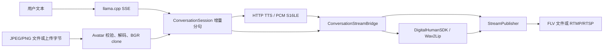

# 实时头像数字人会话运行指南

> 适用日期：2026-08-11  
> 适用入口：`full_conversation_chain_test`、`realtime_avatar_conversation`

## 1. 能力与边界

当前项目已经具备：

- 调用 E 盘 `llama.cpp` 的 OpenAI-compatible Chat Completions 接口；
- 调用真实本地 TTS，接收 16 kHz、单声道、PCM S16LE；
- 对 JPEG/PNG 编码字节执行格式、大小、宽高和像素数校验；
- 将图片归一化为独立拥有内存的 BGR 头像；
- 在同一会话生命周期中通过 `/avatar` 热更新头像；
- 经 Wav2Lip 生成数字人口型帧，并编码为 H.264 + AAC；
- 输出本地 FLV，或发布到接收推流的 RTMP/RTSP 服务。

当前交互入口是**本机终端会话**。项目提供了可供 HTTP/multipart 网关调用的上传字节 API，但尚未提供浏览器页面、multipart HTTP Server、鉴权或公网会话网关。

## 2. 链路



## 3. 启动 llama.cpp

在 Windows PowerShell 的独立终端中运行项目脚本：

```powershell
powershell -NoProfile -ExecutionPolicy Bypass -File .\tools\start_llama_cpp_server.ps1 `
  -LlamaRoot 'E:\llama.cpp' `
  -ModelPath 'E:\llama.cpp\models\Qwen3-4B-Q4_K_M.gguf' `
  -ListenHost '127.0.0.1' `
  -Port 8090 `
  -ContextSize 8192 `
  -GpuLayers 99 `
  -Parallel 1
```

验证：

```powershell
Invoke-RestMethod 'http://127.0.0.1:8090/health'
```

预期返回包含 `{"status":"ok"}`。

### WSL 访问 Windows 服务

WSL2 中的 Linux 程序通常不能直接访问 Windows 的 `127.0.0.1`。可通过 `ip route` 查看默认网关地址：

```bash
ip route | awk '/default/ {print $3; exit}'
```

仅在本机验收期间，可让 llama.cpp 临时绑定该 WSL 虚拟网络地址，并将端点改为：

```text
http://<wslHost>:8090/v1/chat/completions
```

该绑定没有认证。验收结束后应恢复到 `127.0.0.1`，不要绑定 `0.0.0.0`。

## 4. 启动真实 TTS

两种实现都接受：

```json
{"text":"你好","sample_rate":16000,"channels":1,"format":"pcm_s16le"}
```

并返回裸 PCM S16LE 字节流。

### Windows System.Speech

在独立 PowerShell 终端运行：

```powershell
powershell -NoProfile -ExecutionPolicy Bypass -File .\tools\windows_tts_service.ps1 `
  -ListenHost '127.0.0.1' `
  -Port 18080 `
  -Voice 'Microsoft Huihui Desktop'
```

```powershell
Invoke-RestMethod 'http://127.0.0.1:18080/health'
```

若 voice 未安装，脚本会列出可用 voice。服务限制请求体最大 64 KiB、文本最大 2000 字符。

### WSL eSpeak NG 验收服务

当 WSL 程序无法访问 Windows TTS 环回地址时：

```bash
sudo apt-get update
sudo apt-get install -y espeak-ng ffmpeg
python3 tools/espeak_tts_service.py --host 127.0.0.1 --port 18080 --voice cmn --speed 150
```

该服务适合本地开发和自动验收；生产语音质量应替换为正式 TTS 服务，但保持相同 PCM 契约即可。

## 5. 构建与单元测试

```bash
cmake -S . -B build-wsl-phase2 \
  -DCMAKE_BUILD_TYPE=Release \
  -Dncnn_DIR=/usr/local/lib/cmake/ncnn \
  -DDIGITAL_HUMAN_REQUIRE_NCNN_VULKAN=OFF

cmake --build build-wsl-phase2 \
  --target avatar_upload_test dialog_module_test lifecycle_safety_test \
           llama_cpp_client_test full_conversation_chain_test \
           realtime_avatar_conversation \
  --parallel 4

ctest --test-dir build-wsl-phase2 \
  -R 'avatar_upload|dialog_module|lifecycle_safety' \
  --output-on-failure
```

上传单测覆盖空输入、伪造格式、Content-Type/魔数不匹配、编码大小、解码尺寸、灰度/BGRA 转 BGR、clone 所有权和运行时头像更新。

## 6. 单轮真实全链路

```bash
./build-wsl-phase2/bin/full_conversation_chain_test \
  http://<wslHost>:8090/v1/chat/completions \
  http://127.0.0.1:18080/tts \
  artifacts/full_chain_uploaded_avatar.flv \
  file \
  Qwen3-4B-Q4_K_M.gguf \
  artifacts/uploaded_avatar.png \
  '请只回复：图片上传会话已成功。'
```

C++ 程序若运行在 Windows 本机，把 llama 地址改为 `127.0.0.1`。

## 7. 持久多轮实时会话

```bash
./build-wsl-phase2/bin/realtime_avatar_conversation \
  http://<wslHost>:8090/v1/chat/completions \
  http://127.0.0.1:18080/tts \
  assets/face.jpg \
  artifacts/realtime_multi_turn.flv \
  Qwen3-4B-Q4_K_M.gguf \
  file
```

启动后输入：

```text
请用一句话问候用户。
/avatar artifacts/uploaded_avatar.png
请确认头像已经更新。
/quit
```

- 普通文本：提交一轮 LLM → TTS → 数字人生成；
- `/avatar <path>`：更新后续帧使用的 JPEG/PNG 头像；
- `/quit`：等待当前轮结束，关闭编码器并退出。

编码画布由初始头像确定。初始宽高若为奇数，会向下调整为偶数；后续头像缩放到固定画布，避免编码流中途改变分辨率。

### RTMP/RTSP

最后一个参数可改为 `rtmp` 或 `rtsp`，输出地址换为允许发布的服务端 URL：

```bash
./build-wsl-phase2/bin/realtime_avatar_conversation \
  http://<wslHost>:8090/v1/chat/completions \
  http://127.0.0.1:18080/tts \
  assets/face.jpg \
  rtmp://127.0.0.1/live/avatar \
  Qwen3-4B-Q4_K_M.gguf \
  rtmp
```

程序是发布客户端，不是 RTMP/RTSP Server。

## 8. 上传字节 API

HTTP 网关收到 multipart 内容后，应传入文件字节，而不是信任客户端文件名：

```cpp
#include "avatar/avatar_image.h"

digital_human::avatar::AvatarImage image;
digital_human::avatar::AvatarUploadLimits limits;
std::string error;

const bool ok = digital_human::avatar::DecodeAvatarUpload(
    encoded_bytes, request_content_type, limits, image, error);
if (ok) {
    session.UpdateAvatar(image.bgr);
}
```

默认限制：10 MiB 编码数据、4096 最大宽高、16 MiPixels。生产网关还应增加鉴权、会话配额、上传限频、请求超时和审计日志。

## 9. 媒体验收

```bash
ffprobe -v error \
  -show_entries format=duration,size:stream=codec_name,codec_type,width,height,sample_rate \
  -of json \
  artifacts/realtime_multi_turn.flv
```

通过标准：存在 H.264 视频流和 AAC 音频流，宽高为正且为偶数，`duration`/`size` 大于零，程序指标中的 `video`、`audio`、`packets` 均大于零。

## 10. 当前限制

- 尚无浏览器 UI、multipart HTTP Server、用户体系和鉴权；
- 尚未接入 ASR，用户输入目前为终端文本；
- Windows System.Speech 与 eSpeak NG 是真实本地 TTS，但不是生产级声音克隆；
- CPU-only ncnn 在高分辨率头像下可能积压，应在生产环境启用受验证的 GPU/Vulkan 路径并监控丢帧；
- 头像热更新只影响后续帧，不会改写已经编码的媒体；
- 不自动应用 EXIF orientation，调用端应在上传前校正。
